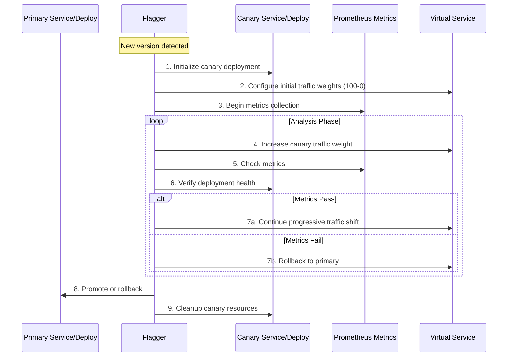

sequenceDiagram
    participant P as Primary Service/Deploy
    participant F as Flagger
    participant C as Canary Service/Deploy
    participant M as Prometheus Metrics
    participant V as Virtual Service
    
    Note over F: New version detected
    F->>C: 1. Initialize canary deployment
    F->>V: 2. Configure initial traffic weights (100-0)
    F->>M: 3. Begin metrics collection
    loop Analysis Phase
        F->>V: 4. Increase canary traffic weight
        F->>M: 5. Check metrics
        F->>C: 6. Verify deployment health
        alt Metrics Pass
            F->>V: 7a. Continue progressive traffic shift
        else Metrics Fail
            F->>V: 7b. Rollback to primary
        end
    end
    F->>P: 8. Promote or rollback
    F->>C: 9. Cleanup canary resources

Let me break down the Flagger Canary Process into clear, sequential steps.

Sequential Steps:

1. Flagger detects deployment changes in the primary deployment (new version or configuration)

2. Creates a canary deployment copying the primary deployment specs with the new version

3. Initializes the traffic routing with 100% to primary and 0% to canary

4. Starts the metric collection baseline for both primary and canary deployments

5. Incrementally increases traffic to canary deployment based on stepWeight configuration

6. Monitors and collects metrics from Prometheus for the specified interval

7. Validates metrics against defined thresholds (success rate, latency, errors)

8. If metrics pass, increases canary traffic weight according to stepWeight

9. If metrics fail at any point, triggers immediate rollback to primary

10. Continues step-by-step weight increase until maxWeight is reached

11. Verifies canary deployment stability at maximum weight

12. If successful, promotes canary to primary by updating primary deployment

13. Updates primary deployment with new version and configuration

14. Scales canary deployment to zero

15. Resets traffic routing to 100% primary

16. Cleans up canary resources and temporary configurations

17. Returns to steady state monitoring for next deployment change

Would you like me to elaborate on any specific step or provide the detailed configuration examples for any of these steps?
